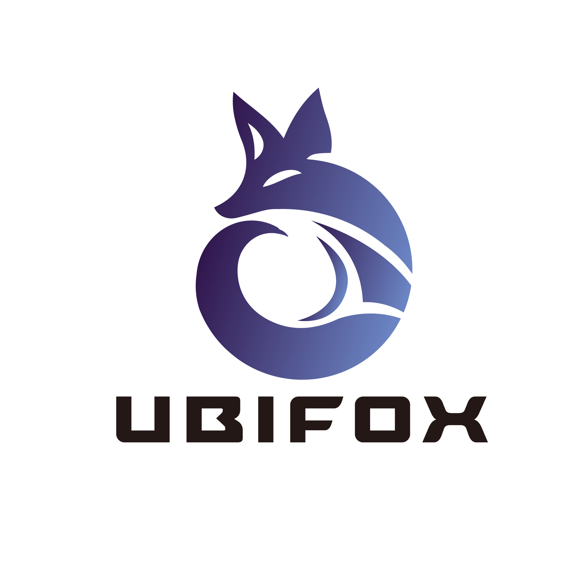

<!-- PROJECT LOGO -->

  
  <h3 align="center">HospitAlien</h3>

  

    An Unity VR game runs standalone on META quest 3
     
    <!--<a href="https://github.com/othneildrew/Best-README-Template"><strong>Explore the docs »</strong></a>
     
     
    <a href="https://github.com/othneildrew/Best-README-Template">View Demo</a>
    &middot;
    <a href="https://github.com/othneildrew/Best-README-Template/issues/new?labels=bug&template=bug-report---.md">Report Bug</a>
    &middot;
    <a href="https://github.com/othneildrew/Best-README-Template/issues/new?labels=enhancement&template=feature-request---.md">Request Feature</a>
  
 -->

<!-- ABOUT THE PROJECT -->

# Overview

HospitAlien is a single player VR game complete with motion sickness and accessibility precautions. The player takes on the role of an alien doctor aboard a spaceship that has just suffered a dangerous collision; all aliens on board are injured and they need the doctor’s help. There are three different species of aliens, all with common and unique illnesses. As the time progresses, more and more aliens flood the room with new illnesses that the player must figure out how to cure. If they are confused on how to cure a patient, the player has the ability to speak directly to the aliens and ask them questions about their illness and the aliens will reply with advice as to how they can be cured. Aliens can suffer from multiple ailments and, once their health is restored, they gratefully will pay the player an amount of money relative to their degree of suffering. 

The main objective of the game is for the player to make as much money as they can by curing as many aliens as possible. As the player progresses through the game, they will gain a higher medical rank based on the amount of money they have earned, and once the game is over their score will be added to a leaderboard, allowing for competition with other players. The game is fast-paced and action-packed, proven to challenge the player as the difficulty increases. 

# Tutorial

When the player first enters the game there is a detailed tutorial to help them get used to the VR controls and foreshadow some of what they can expect in the actual game, allowing the rest to be solved by intuition. The tutorial shows the player how to use some of the instruments and ensures players are properly prepared for the game, while experienced players have the opportunity to skip the tutorial entirely.

# Illnesses

Once the game starts, aliens begin to walk into the hospital and place themselves on  hospital beds - once an alien arrives a countdown is started on a monitor above the bed, to indicate the lifespan of the alien. The doctor has until the countdown reaches 0 to help the patient, after which it dies and disappears. An alien may suffer from multiple illnesses, and the player only receives payment once the alien is fully cured, but each illness cured adds money to the final payout. For all these illnesses, if asked the aliens would explain what they need.

The instruments provided to cure the alien are as follows: 

- Vending Machine
- Buckets of Red, Blue, and Green Blood
- Eye Drops
- Axes
- Growth Pill
- Shrink Pill
- Limbs
- Fire Extinguisher
- Syringe

The types of illnesses are as follows:

## Shrapnel

These are pieces of metal that are lodged into the alien’s torso, which the player must grab and remove. As the player approaches the alien, the metal shards gain a yellow highlight and bright white outline to indicate that the player is close enough to pull them out. Each piece of shrapnel will remain stuck in the body until the player has fully removed it.

## Sweating

Some aliens will be sweating, indicating that they have a blood illness and are in need of an injection. If the alien is injected with their corresponding blood type, they are cured and the sweating will stop, however they will die if injected with the wrong blood type. Therefore, it is important for the player to talk to the patient to clarify its blood type.

## Amputation

Due to a spreading corruption, an alien will have one or more limbs of different colour. In order to cure them, the player must first use the axe to amputate the alien's corrupted limb(s), then order a healthy version of the specific limb from the vending machine, where it can then be reattached to the alien.

## Eye Infection

An alien’s eye may be dry and bloodshot. In this scenario the player must use the eye drops to moisturise and restore the eyeball.

## Enlarged

An alien appears much bigger than its usual size, and the player must order a shrink pill from the vending machine which can be fed to the alien in order to return it back to its normal size.

### Miniscule

Similar to the enlargement illness, except this time the alien appears smaller than usual.  The player must order a growth pill from the vending machine to return the alien to normal size.

## Burning

An alien is engulfed by flames and the player must use the fire extinguisher to put them out. 

# Difficulty

There are three levels in this game separated by two distinct events. Each level there is a maximum number of ailments an alien can have: in the first level the aliens can have up to two illnesses simultaneously, up to three in the second and between two to four in the third. New illnesses are also introduced in the later levels to decrease familiarity with curing the alien, and their difficulty scales with the current level.

# Events

There are multiple events designed to break the chaos of the main game, and to give the player time to prepare for the following level. They are as follows: 

## Pizza Time

the first event between levels one and two, where pizza slices begin to float around the room in zero-gravity and players are rewarded money for each slice they eat. This incites the player to collect and consume as many slices as they can in the short time period to maximise their earnings.

## Ghost Attack

the second event between levels two and three, where the player is provided a laser gun to fend off a swarm of alien ghosts. The player will be rewarded with extra money for each ghost they exterminate.

(<a href="#readme-top">back to top</a>)

